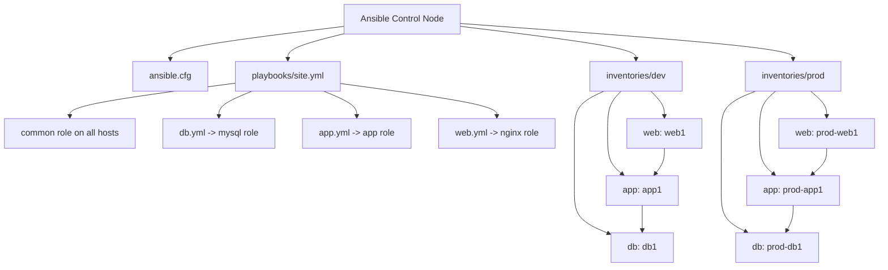
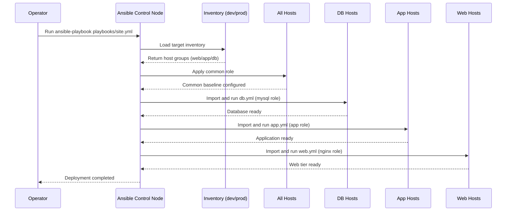

# Ansible Production Deployment Project

This project demonstrates a real-world, production-grade Ansible deployment using:
- Role-based architecture
- Multi-tier setup (Web, App, DB)
- Idempotent automation
- Environment isolation (Dev/Prod)

## Architecture Diagram

## Deployment Sequence Diagram

## Run in Dev
ansible-playbook playbooks/site.yml

## Dry Run
ansible-playbook playbooks/site.yml --check

## Run in Prod
ansible-playbook -i inventories/prod/hosts playbooks/site.yml